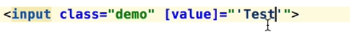
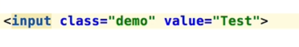

# INTRODUCTION

## 005 Introduction To Angular - Custom HTML Elements, Model vs View

```bash
npm i -g @angular/cli
```

verify the installation


let's create a new angular project

```bash
ng new my-first-app
```

this will prompt you to select the routing and stylesheet format, select as per your requirement.

navigate to the project folder

```bash
cd my-first-app
```

let's run the project

```bash
npm start
```

go to <http://localhost:4200/>

let's see the project structure

```bash
ls
```


output


let's inspect the `index.html` file

```html
<!doctype html>
<html lang="en">
<head>
  <meta charset="utf-8">
  <title>AngualrCourse</title>
  <base href="/">
  <meta name="viewport" content="width=device-width, initial-scale=1">
  <link rel="icon" type="image/x-icon" href="favicon.ico">
</head>
<body>
  <app-root></app-root>
</body>
</html>
```

let's inspect the `app.component.ts` file

```typescript
import { RouterOutlet } from '@angular/router';

@Component({
  selector: 'app-root',
  standalone: true,
  imports: [RouterOutlet],
  templateUrl: './app.component.html',
  styleUrl: './app.component.css'
})
export class AppComponent {
  title = 'angular-router';
  onButtonClicked(){
    console.log('Button clicked');
  }
  onKeyup(value: string){
    console.log(`Keyup event ${value}`);
    this.title = value;
  }
}
```

here, `app-root` is the root component of the angular application.
we specify the selector as `app-root` in the `app.component.ts` file.

then in index.html file, we have the following line

```html
<app-root></app-root>
```

here in our app.component.ts file, we have the following line

```typescript
export class AppComponent {
  title = 'angular-router';
  onButtonClicked(){
    console.log('Button clicked');
  }
  onKeyup(value: string){
    console.log(`Keyup event ${value}`);
    this.title = value;
  }
}
```

if we want to access the title property from the `app.component.html` file, we can do so by using the following syntax

```html
<h1>{{title}}</h1>
```

`{{title}}` is the interpolation syntax, which is used to access the properties of the component in the view.

Angular uses MVC architecture, where `app.component.ts` is the controller, `app.component.html` is the view and `app.component.css` is the style.

## 006 Why Angular Learn the Key Features of Angular Core

let's add a input element in the `app.component.html` file

```html
<input class="demo" [value]="title">
```

by using the above syntax, we can bind the value of the input element to the title property of the component.

if we want to pass a string



or just use the plain string



to handle `events` in angular, we can use the following syntax

```html
<button (click)="onButtonClicked()">Click me</button>
```

```typescript
onButtonClicked(){
  console.log('Button clicked');
}
```

we can use `Template Reference Variables` to access the input element in the component.

```html
<input class="demo" [value]="title" #inputRef>
<button (click)="onButtonClicked(inputRef)">Click me</button>
```

```typescript
onButtonClicked(inputRef: HTMLInputElement){
  console.log(inputRef.value);
}
```

angular also escapes the html by default, if we want to render the html as it is, we can use the following syntax

```html
<p [innerHTML]="title"></p>
```

if not, angular will escape the html

```html
<p>{{title}}</p>
```
